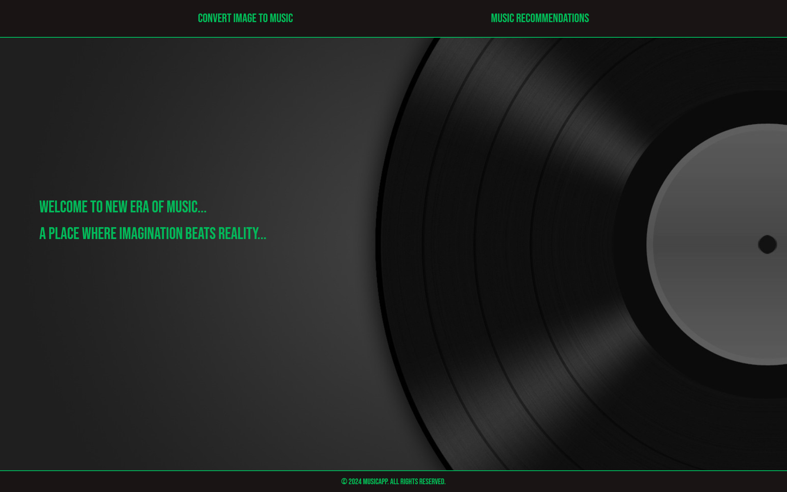
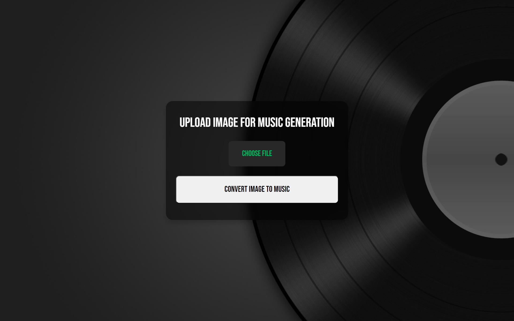
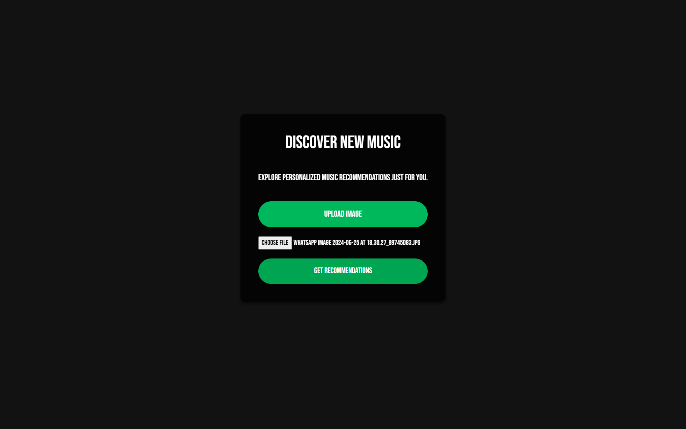
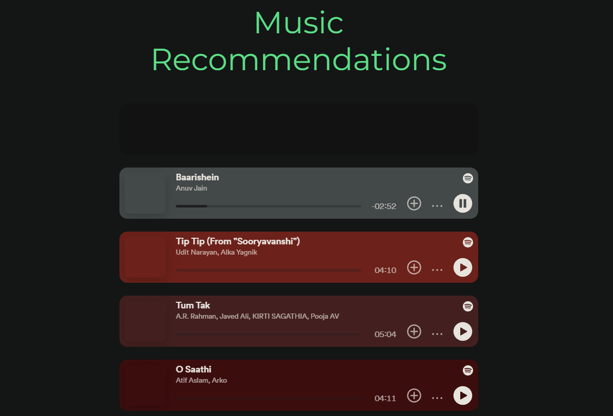

# MusicGenAI: Image-to-Music Generation and Recommendation

MusicGenAI is an innovative project that combines image analysis, music generation, and song recommendation using advanced AI techniques. This system takes an input image, generates a textual caption, creates original music based on that caption, and recommends similar songs from a vast database.

## Features

- Image captioning using BLIP (Bootstrapping Language-Image Pre-training)
- Music generation from textual descriptions using MusicGen
- Song recommendation based on lyrical similarity using RoBERTa and KNN
- Web interface built with Django

## Web Interface Screenshots

Here are some screenshots of the MusicGenAI web interface:
### Homepage








### Recommendations



## Results

### Image to Audio Generation

#### Input


#### Result


https://github.com/CrypticOwl5503/MusicGenAI/assets/92156713/5e00901b-7d5e-4721-99df-45a6f3428dc3


[Download the same audio](musicgen_Images/peace.wav)

#### Input


#### Result


https://github.com/CrypticOwl5503/MusicGenAI/assets/92156713/c65c1f53-f782-4ef4-af99-4a868e4a2334


[Download the same audio](musicgen_Images/anime.wav)

### Image to Song Recommendation

#### Input


#### Result

Badal Pe Paon Hain by Hema Sardesai


https://github.com/CrypticOwl5503/MusicGenAI/assets/92156713/ac642463-0d3c-4941-928a-f36b32e599ca


[Download the same audio](assets/cloud.mp3)

#### Input


#### Result

All I Want For Christmas Is You


https://github.com/CrypticOwl5503/MusicGenAI/assets/92156713/7852dcfa-535a-4128-a067-6a44168bd4c9


[Download the same audio](assets/christmas.mp3)

## Installation

1. Clone the repository:
   ```sh
   git clone https://github.com/yourusername/MusicGenAI.git
   cd MusicGenAI
2. Create a virtual environment and activate it:
   ```sh
   python -m venv venv
   source venv/bin/activate   # On Windows, use `venv\Scripts\activate`
3. Install the required packages:
   ```sh
   pip install -r requirements.txt
4. Ensure the database is setup well by running the following command in the project directory:
   ```sh
   python manage.py migrate
5. Download the data files, either for hindi or english dataset from
   ```sh
   https://drive.google.com/drive/folders/1k3eUSBngBh0PYAet40iKtCOG2Fdy5PA2?usp=sharing
6. Paste the .obj files in the data folder(you should paste 2 files, either for hindi or english).
7. Run the development server:
   ```sh
   python manage.py runserver
## Usage

1. Navigate to `http://localhost:8000` in your web browser.
2. Upload an image or provide a URL to an image.
3. The system will generate a caption, create music, and provide song recommendations.

## Technical Details

### Music Recommendation

Our music recommendation system leverages a dataset of over 100,000 songs from top 100 billboards since 1958. The process involves several key steps:

#### Dataset
1. Data Source
- Song lyrics scraped from Genius API
- Song features from Spotify API
- Song list based on Wasabi dataset

2. Dataset Composition
- Corpus size: 100,000 songs
- Selection criteria: 
  - Songs with Spotify ID
  - Artists in the top 100 billboards since 1958

3. Dataset Cleaning
- Filtered from ~2 million songs based on artist popularity
- Song attributes analyzed: danceability, energy, speechiness, acousticness, liveness, and valence
- Good distribution of mood range, with normally distributed song attributes

#### Information Retrieval Model

1. Model Development:
- Feature Engineering: We employ a pre-trained RoBERTa model within the Sentence Transformer framework to transform lyrics into dense vectors for semantic analysis.
- Semantic Similarity: Cosine distance is used in a K-Nearest Neighbor (KNN) model to find songs with lyrics most similar to user queries.
- Fine-Tuning: The model's understanding of lyrics is improved by fine-tuning with paired lyrics and annotations from the Genius community.

2. Results Ranking and Evaluation:
- Score Calibration: A ranking algorithm emphasizes highly relevant lyrics while penalizing less relevant ones to enhance recommendation quality.
- Model Comparison: Performance of pre-trained and fine-tuned models is compared, noting potential overfitting in the fine-tuned model.

### Music Generation

Our music generation process is a two-step procedure:

1. Image Captioning:
We use the BLIP (Bootstrapping Language-Image Pre-training) model from Salesforce to generate textual captions of images. BLIP utilizes a Transformer-based architecture with two main components:
- Visual Encoder: A convolutional neural network (CNN) or vision transformer (ViT) that processes the input image and generates feature vectors representing different regions of the image.
- Textual Decoder: A language model transformer that generates the caption one word at a time, conditioning on both the previously generated words and the image features.

The caption generation process involves image processing, an attention mechanism, contextual understanding, iterative refinement, and fine-tuning on targeted data.

2. Music Generation:
We use the MusicGen model from Facebook to produce music based on the generated captions. Key aspects of MusicGen include:
- Model Architecture: An autoregressive transformer-based decoder that generates music from text or melody inputs.
- Audio Tokenization: Employs EnCodec with Residual Vector Quantization to convert audio into discrete token streams.
- Transformer and Conditioning: Incorporates causal and cross-attention mechanisms, using positional embeddings to enhance temporal coherence.
- Optimization and Training: Utilizes models with up to 3.3B parameters, optimized with techniques such as AdamW and adaptive learning rates.
- Evaluation: Trained on 20K hours of music and evaluated against the MusicCaps benchmark.

This integrated system bridges the gap between visual inputs and musical outputs, creating a unique and engaging user experience.

## 🤝 Collaboration

We welcome contributions from the community! Here’s how you can get involved:

1. **Fork the Repository**: Click the "Fork" button on the top right to get a copy of the repository.
2. **Clone Your Fork**: Use `git clone <your-fork-url>` to clone your forked repository to your local machine.
3. **Create a Branch**: Use `git checkout -b feature-name` to create a new branch.
4. **Make Changes**: Implement your changes and commit them with clear and descriptive messages.
5. **Push Your Changes**: Use `git push origin feature-name` to push your changes to your fork.
6. **Create a Pull Request**: Go to the original repository and create a pull request, describing your changes and the reasons for them.

## Acknowledgments

- Course Project for DA213 (Python Lab)
- Instructor: Assistant Prof. Dr. Teena Sharma
